# Craftflow Sitemap

## Visual Sitemap (Mermaid Diagram)

```mermaid
flowchart TB
    subgraph HOME["/"]
        home[Dashboard]
    end

    subgraph ORDERS["Orders"]
        orders_list["/orders - Orders List"]
        orders_new["/orders/new - New Order"]
        subgraph ORDER_DETAIL["/orders/[id]"]
            order_view["Order Details"]
            order_costing["/costing - Costing"]
            order_decorations["/decorations - Decorations"]
            order_production["/production - Production"]
            order_summary["/summary - Summary"]
        end
    end

    subgraph QUOTES["Quotes"]
        quotes_list["/quotes - Quotes List"]
        quotes_new["/quotes/new - New Quote"]
        subgraph QUOTE_DETAIL["/quotes/[id]"]
            quote_view["Quote Details"]
            quote_edit["/edit - Edit Quote"]
        end
    end

    subgraph PRODUCTION["Production"]
        prod_dash["/production - Dashboard"]
        prod_prep["/production/prep - Prep Review"]
        prod_prep_order["/production/prep/[orderId]"]
        prod_batch["/production/batch-planner - Batch Planner"]
        prod_gantt["/production/gantt - Gantt Chart"]
        prod_assign["/production/assignments - Assignments"]
        prod_assign_order["/production/assignments/[orderId]"]
        prod_my_tasks["/production/my-tasks - My Tasks"]
        prod_shopping["/production/shopping-list - Shopping List"]
        prod_checklist["/production/checklist - Checklist"]
        prod_delivery["/production/delivery - Delivery"]
        prod_stock["/production/stock - Stock"]

        subgraph PROD_ITEMS["Product Lines"]
            prod_cupcakes["/production/cupcakes"]
            prod_cookies["/production/cookies"]
            prod_macarons["/production/macarons"]
            prod_cake_pops["/production/cake-pops"]
            prod_cakeboards["/production/cakeboards"]
            prod_graphics["/production/graphics"]
            prod_stacking["/production/stacking"]
        end
    end

    subgraph ADMIN["Admin"]
        subgraph ADMIN_CATALOG["Catalog"]
            admin_recipes["/admin/recipes"]
            admin_recipes_new["/admin/recipes/new"]
            admin_recipes_id["/admin/recipes/[id]"]
            admin_ingredients["/admin/ingredients"]
            admin_decorations["/admin/decorations"]
            admin_decorations_new["/admin/decorations/new"]
            admin_decorations_id["/admin/decorations/[id]"]
            admin_tiers["/admin/tiers"]
            admin_tiers_new["/admin/tiers/new"]
            admin_tiers_id["/admin/tiers/[id]"]
            admin_cakeboards["/admin/cakeboards"]
        end

        subgraph ADMIN_MENU["Menu"]
            admin_menu["/admin/menu"]
            admin_menu_new["/admin/menu/new"]
            admin_menu_id["/admin/menu/[id]"]
            admin_menu_pkg["/admin/menu/packaging"]
        end

        subgraph ADMIN_PEOPLE["People & Business"]
            admin_customers["/admin/customers"]
            admin_customers_new["/admin/customers/new"]
            admin_customers_id["/admin/customers/[id]"]
            admin_staff["/admin/staff"]
            admin_staff_id["/admin/staff/[id]"]
            admin_vendors["/admin/vendors"]
            admin_vendors_new["/admin/vendors/new"]
            admin_vendors_id["/admin/vendors/[id]"]
        end

        subgraph ADMIN_CONFIG["Configuration"]
            admin_settings["/admin/settings"]
            admin_labor["/admin/labor-roles"]
            admin_delivery["/admin/delivery-zones"]
            admin_volume["/admin/volume-breakpoints"]
        end
    end

    home --> orders_list
    home --> quotes_list
    home --> prod_dash
    home --> ADMIN

    orders_list --> orders_new
    orders_list --> ORDER_DETAIL

    quotes_list --> quotes_new
    quotes_list --> QUOTE_DETAIL

    prod_dash --> prod_prep
    prod_dash --> prod_batch
    prod_dash --> prod_gantt
    prod_dash --> prod_assign
    prod_dash --> prod_my_tasks
```



---

## Editable Sitemap (YAML Format)

Copy and modify this structure, then share it with Claude to reorganize the site.

```yaml
# CRAFTFLOW SITEMAP - Editable Version
# Instructions:
#   - Reorder sections by moving them up/down
#   - Add new pages with: "- path: /new-page, title: Page Title, status: planned"
#   - Mark pages for removal: "status: remove"
#   - Add notes with: "notes: your notes here"

sitemap:
  - section: Home
    pages:
      - path: /
        title: Dashboard
        description: Main dashboard with upcoming orders and quick stats

  - section: Orders
    pages:
      - path: /orders
        title: Orders List
        description: View and manage all orders
      - path: /orders/new
        title: New Order
        description: Create a new cake order
      - path: /orders/[id]
        title: Order Details
        description: View order with customer, tiers, decorations
        children:
          - path: /orders/[id]/costing
            title: Order Costing
          - path: /orders/[id]/decorations
            title: Order Decorations
          - path: /orders/[id]/production
            title: Order Production Tasks
          - path: /orders/[id]/summary
            title: Order Summary/Invoice

  - section: Quotes
    pages:
      - path: /quotes
        title: Quotes List
        description: View all quotes and proposals
      - path: /quotes/new
        title: New Quote
        description: Create a new quote for customer
      - path: /quotes/[id]
        title: Quote Details
        children:
          - path: /quotes/[id]/edit
            title: Edit Quote

  - section: Production
    pages:
      - path: /production
        title: Production Dashboard
        description: Overview of all production activities
      - path: /production/prep
        title: Prep Review
        description: Review orders and generate production tasks
      - path: /production/batch-planner
        title: Batch Planner
        description: Group similar tasks, drag-drop scheduling
      - path: /production/gantt
        title: Gantt Chart
        description: Timeline view of all production tasks
      - path: /production/assignments
        title: Staff Assignments
        description: View orders assigned to staff
      - path: /production/my-tasks
        title: My Tasks
        description: Personal task list for logged-in staff
      - path: /production/shopping-list
        title: Shopping List
        description: Ingredients needed for orders
      - path: /production/checklist
        title: Checklist
        description: Daily production checklist
      - path: /production/delivery
        title: Delivery Schedule
        description: Upcoming deliveries
      - path: /production/stock
        title: Stock Tasks
        description: Inventory replenishment tasks
    product_lines:
      - path: /production/cupcakes
        title: Cupcakes
      - path: /production/cookies
        title: Cookies
      - path: /production/macarons
        title: Macarons
      - path: /production/cake-pops
        title: Cake Pops
      - path: /production/cakeboards
        title: Cakeboards
      - path: /production/graphics
        title: Graphics/Printing
      - path: /production/stacking
        title: Cake Stacking

  - section: Admin - Catalog
    pages:
      - path: /admin/recipes
        title: Recipes
        description: Manage cake, frosting, filling recipes
      - path: /admin/ingredients
        title: Ingredients
        description: Ingredient catalog with costs
      - path: /admin/decorations
        title: Decoration Techniques
        description: Decoration types and pricing
      - path: /admin/tiers
        title: Tier Sizes
        description: Cake tier size options
      - path: /admin/cakeboards
        title: Cakeboard Types
        description: Cakeboard options and pricing

  - section: Admin - Menu
    pages:
      - path: /admin/menu
        title: Menu Items
        description: Product menu for ordering
      - path: /admin/menu/packaging
        title: Packaging
        description: Boxes, bags, packaging options

  - section: Admin - People
    pages:
      - path: /admin/customers
        title: Customers
        description: Customer database
      - path: /admin/staff
        title: Staff
        description: Staff members and roles
      - path: /admin/vendors
        title: Vendors
        description: Ingredient suppliers

  - section: Admin - Configuration
    pages:
      - path: /admin/settings
        title: Settings
        description: Business settings
      - path: /admin/labor-roles
        title: Labor Roles
        description: Staff roles and hourly rates
      - path: /admin/delivery-zones
        title: Delivery Zones
        description: Delivery areas and fees
      - path: /admin/volume-breakpoints
        title: Volume Breakpoints
        description: Bulk order discounts
```

---

## How to View in GitHub

1. **Commit this file** to your repository
2. **Navigate to the file** in GitHub: `docs/SITEMAP.md`
3. **GitHub automatically renders Mermaid diagrams** in markdown files
4. You'll see the flowchart visualized directly in the browser

### Alternative: Use Mermaid Live Editor
1. Go to [mermaid.live](https://mermaid.live)
2. Copy just the mermaid code block (between the ```mermaid and ```)
3. Paste it in the editor to see and export as PNG/SVG

---

## How to Update the Site Structure

1. **Edit the YAML section above** with your desired changes
2. **Share the modified YAML** with Claude
3. **Tell Claude what you want**, for example:
   - "Move the Quotes section under Orders"
   - "Add a new /reports section with these pages..."
   - "Remove the /production/stacking page"
   - "Rename /admin/recipes to /admin/catalog/recipes"

Claude will then create/move/rename the actual page files to match your updated sitemap.
