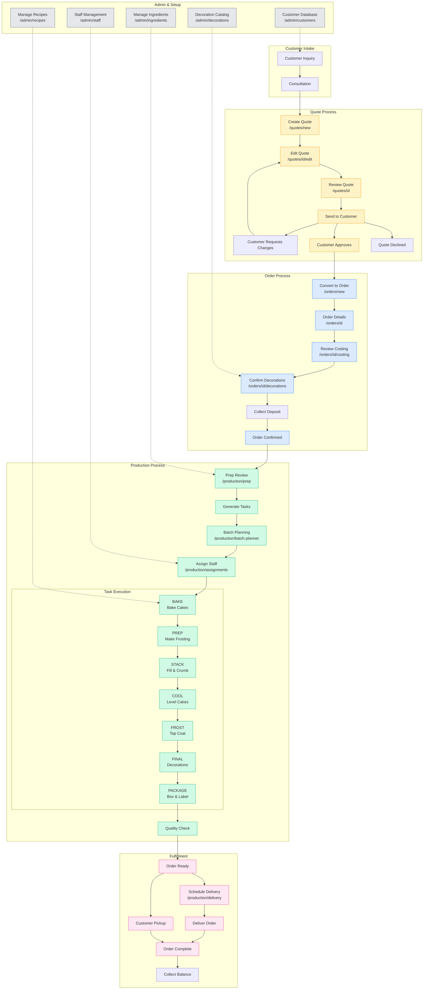
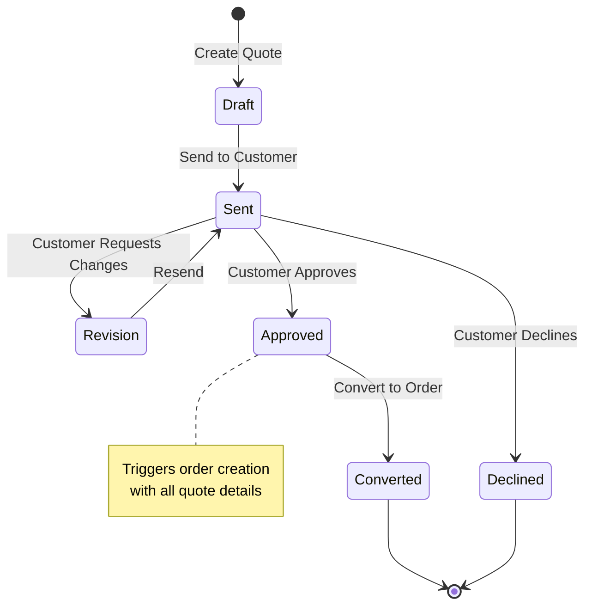
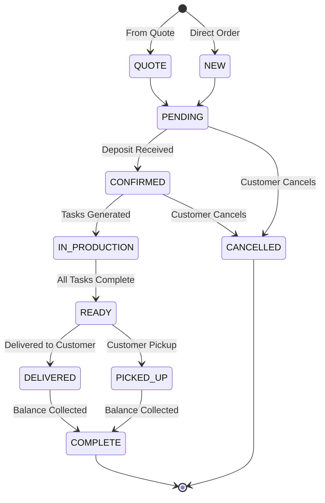
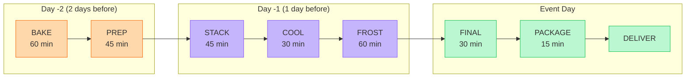
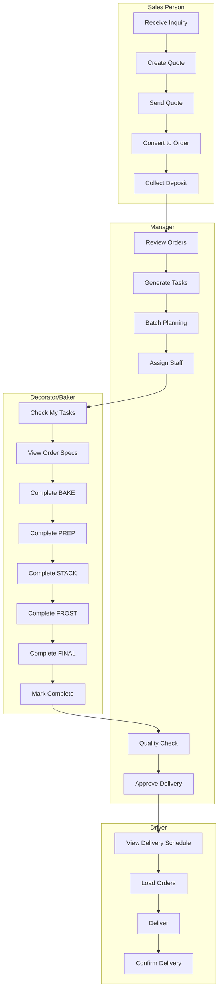

# Craftflow User Flows

## Complete System Flow



---

## Quote Lifecycle



---

## Order Lifecycle



---

## Production Task Flow



---

## Staff Workflow by Role



---

## Editable Flow Format (YAML)

Use this to describe changes you want:

```yaml
flows:
  - name: Quote to Order
    steps:
      - page: /quotes/new
        action: Create quote
        next: /quotes/[id]/edit
      - page: /quotes/[id]/edit
        action: Configure tiers, decorations, pricing
        next: /quotes/[id]
      - page: /quotes/[id]
        action: Review and send to customer
        next: Customer receives email
      - trigger: Customer approves
        action: Quote status → APPROVED
        next: /orders/new (pre-filled from quote)
      - page: /orders/new
        action: Confirm order details
        next: /orders/[id]
      - page: /orders/[id]
        action: Collect deposit
        next: Order status → CONFIRMED

  - name: Order to Production
    steps:
      - trigger: Order CONFIRMED
        action: Appears in /production/prep
      - page: /production/prep
        action: Manager reviews, clicks Generate Tasks
        next: Tasks created in database
      - page: /production/batch-planner
        action: Group similar tasks, schedule dates
      - page: /production/assignments
        action: Assign lead decorator
      - trigger: Tasks assigned
        action: Appears in /production/my-tasks for staff

  - name: Task Execution
    sequence:
      - BAKE → PREP → STACK → COOL → FROST → FINAL → PACKAGE
    notes: Each task has status PENDING → IN_PROGRESS → COMPLETED
```

---

## How to View These Diagrams

1. **GitHub**: Push this file and view in repo - GitHub renders Mermaid
2. **Mermaid Live**: Copy a diagram to [mermaid.live](https://mermaid.live)
3. **VS Code**: Install "Markdown Preview Mermaid Support" extension

## How to Request Changes

Tell me things like:
- "Add a step between Quote Approved and Order Created for contract signing"
- "The COOL step should happen before STACK, not after"
- "Add a Customer Portal section where customers can view their order status"
- "We need an approval gate between FINAL and PACKAGE for manager sign-off"
